# 图文教程

从零开始，把 Debata 跑起来。

---

## 1. 安装 NapCat

Debata 通过 NapCat 接入 QQ。先到 [NapCat 官网](https://napneko.github.io/guide/start-install) 下载安装，按教程跑起来。

NapCat 启动后，记下它的 WebSocket 地址和 token（如果设了的话）——下一步要用。

---

## 2. 启动 Debata

```bash
git clone https://github.com/binglang001/Debata_Agent.git
cd Debata_Agent

python -m venv venv
venv\Scripts\activate       # Windows
source venv/bin/activate    # macOS / Linux

pip install -e ".[gui]"
python main.py
```

首次启动会自动进入配置向导。

---

## 3. 走完向导

### 第一步：选路径

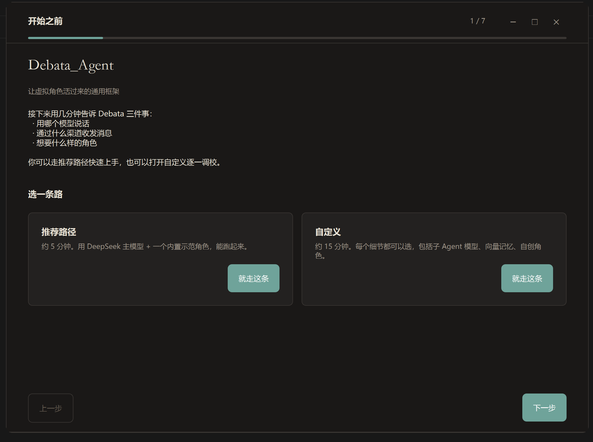

推荐路径 7 步搞定，自定义路径可以逐个调整。首次用选推荐就行。

### 第二步：主模型

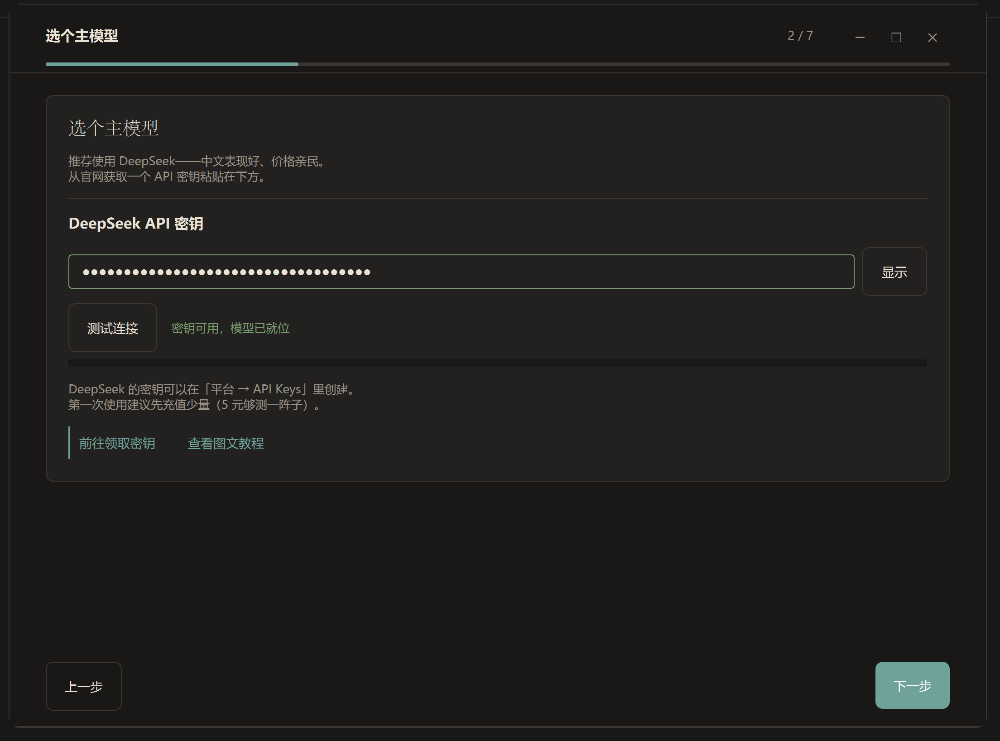

填入 DeepSeek API 密钥，点「测试连接」验证。推荐先充 5 块钱，够测很久。

### 第三步：可选功能

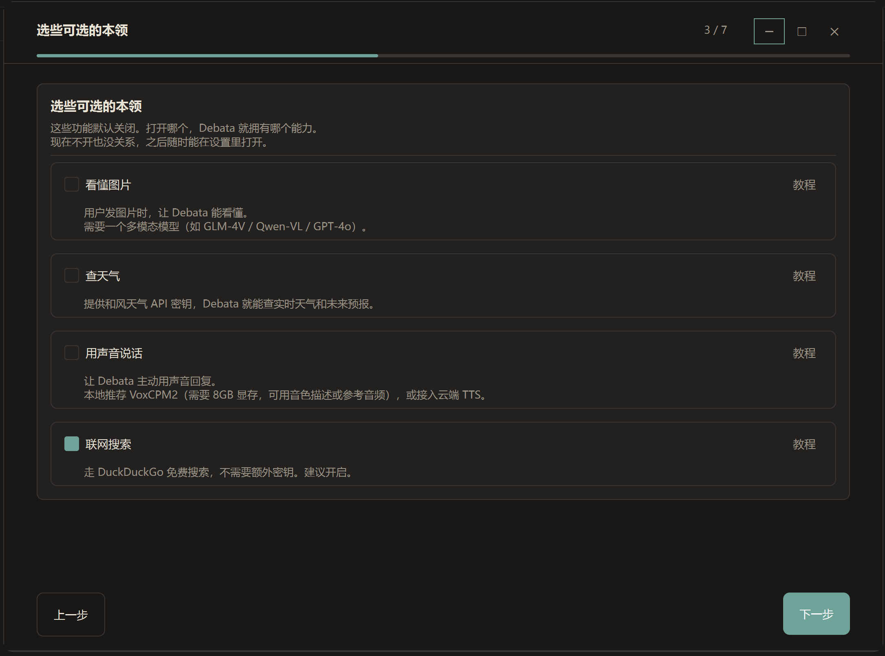

想看图的打开 Vision，想查天气的打开 Weather，联网搜索建议开启（免费）。

### 第四步：记忆方式

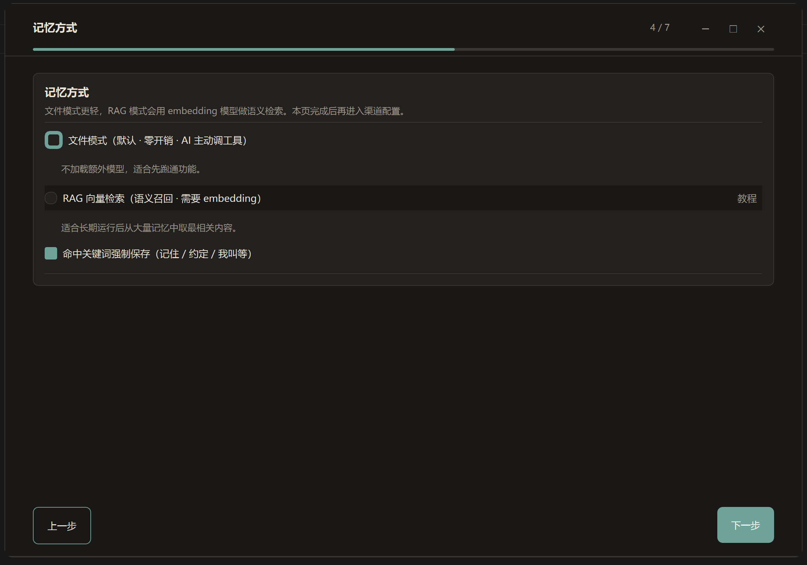

选文件模式还是 RAG 向量检索。文件模式零配置直接用，向量模式需要配一个 embedding 服务，但长期运行检索更准。单人用文件模式就够了。

### 第五步：接 NapCat

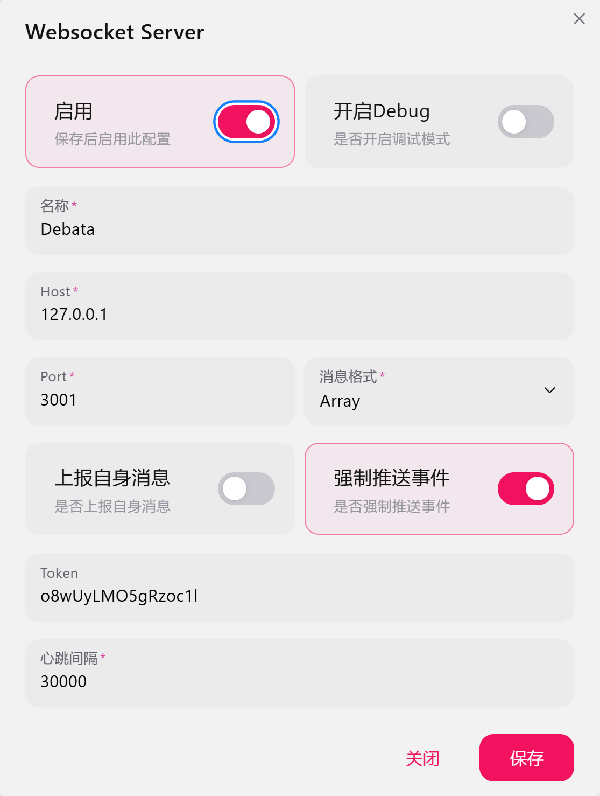

填 NapCat 的 WebSocket 地址和 token。白名单选「管理员审核」——陌生人需要你确认才能触发 Debata。

### 第六步：选角色

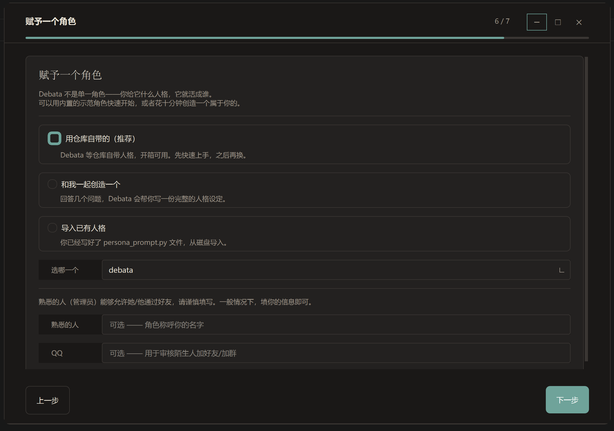

内置的 Debata 可以先用着。想自创的话选「和我一起创造一个」，填几个问题 AI 帮你写。

### 确认 & 启动

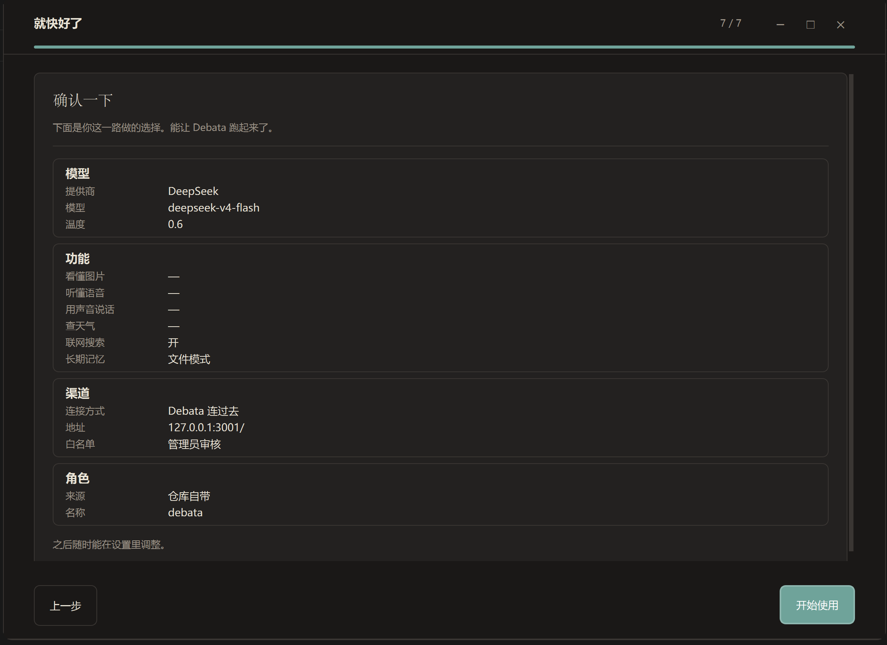

看一眼配置没问题，点「启动」。以后在设置页随时能改。

---

## 4. 仪表盘

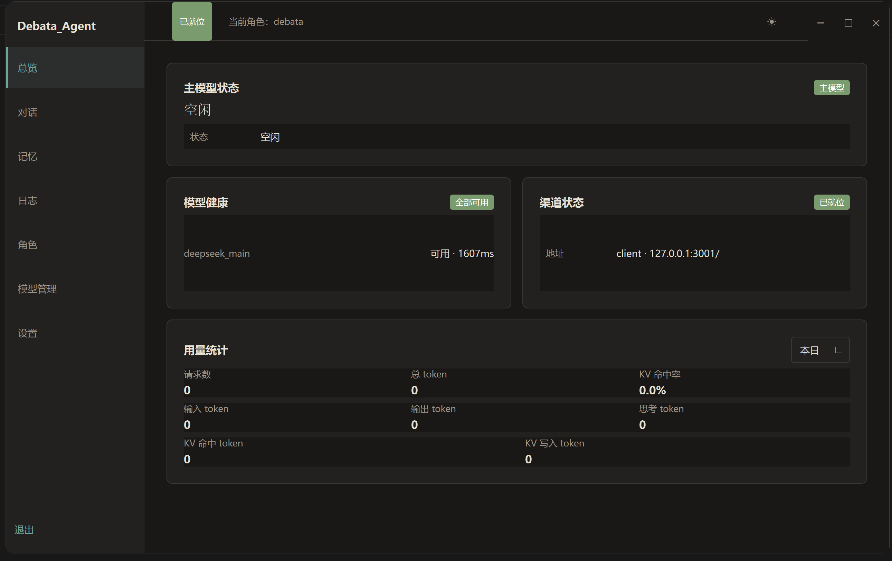

启动后进入仪表盘。左侧 7 个导航：

- **总览** —— 渠道状态、模型健康、用量统计、主模型活动
- **对话** —— 查看历史对话，展开思考过程
- **记忆** —— 管理 Debata 记住的重要信息
- **日志** —— 实时日志流，按等级和模块过滤
- **角色** —— 切换、新建、修改、导入导出人格
- **模型管理** —— 本地模型安装状态
- **设置** —— 一切配置、实时保存、无需重启（部分项需重启服务）

---

## 5. 常见操作

### 切换人格

角色页 → 选目标角色 → 点「切换为当前」→ 重启 Debata。

### 加表情包

把自己收藏的表情包（png / jpg / gif）放进 `data/emoji/` 目录。文件名就是 AI 引用时的名字，建议起易读的（如「笑哭」「困」）。设置页表情包区域也能拖放添加。

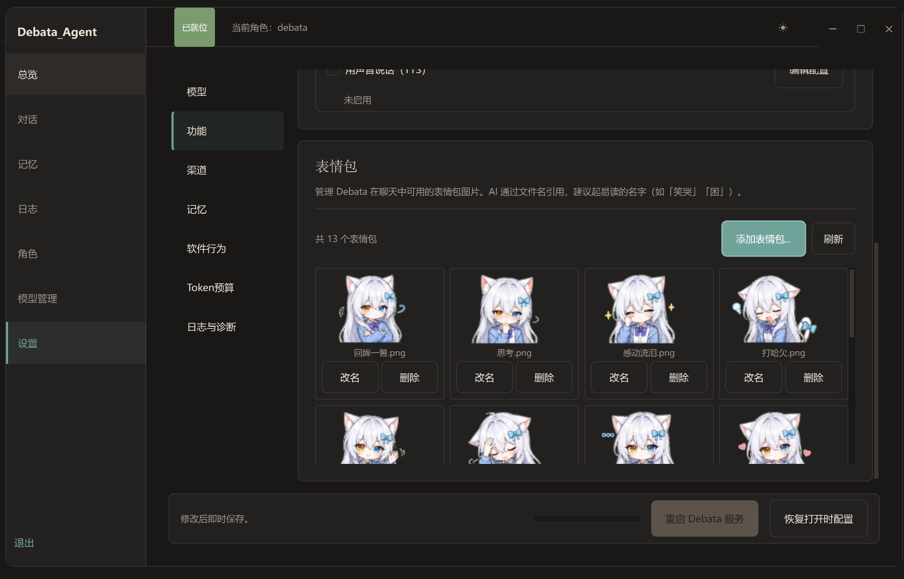

### 改模型

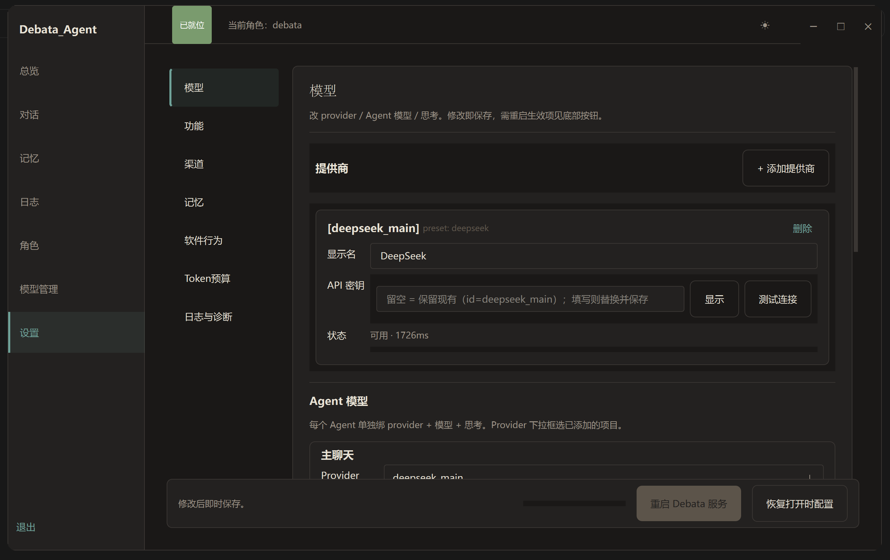

设置页 → 模型 → 改 Provider 的 API 密钥，或给 Agent 换模型。改完点测试连接确认。

### 调主题

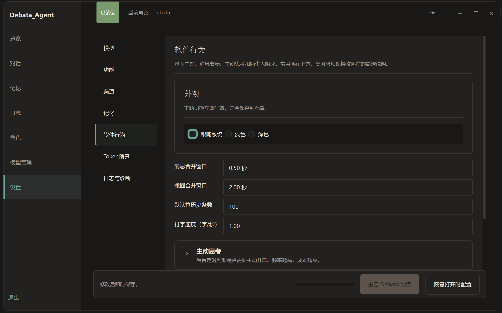

设置页 → 软件行为 → 外观 → 深浅主题即时切换。

---

## 6. 常见问题

**NapCat 连不上**
检查 NapCat 是否在跑，WS 地址和端口对不对。设置页的「测试连接」可以诊断。

**API 密钥无效**
确认密钥复制完整（sk- 开头），账户余额是否充足。

**没收到消息**
检查白名单模式——如果是「白名单」模式且你的 QQ 不在名单里，Debata 不会回复。切到「管理员审核」试试。

**日志级别太吵**
设置页 → 日志与诊断 → 日志级别切到 INFO 或 WARNING。排查问题时再开 DEBUG。
